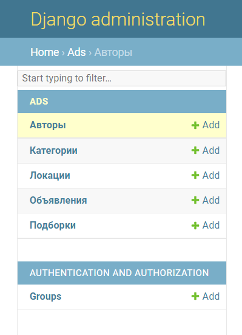
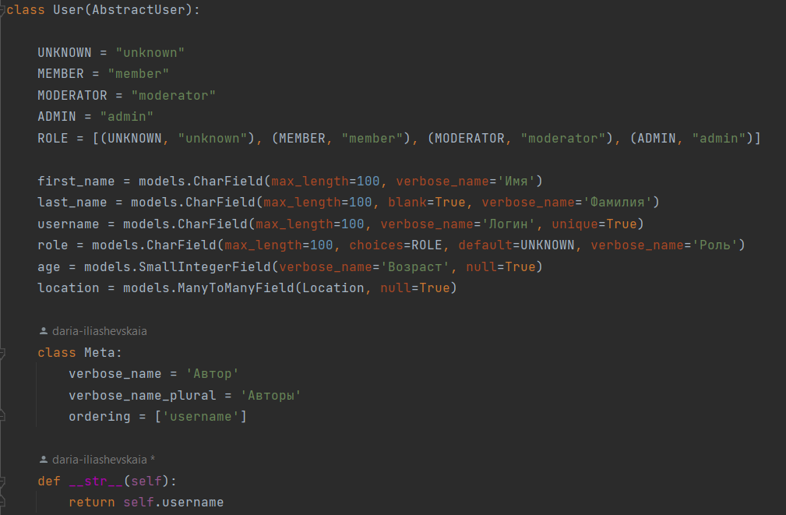
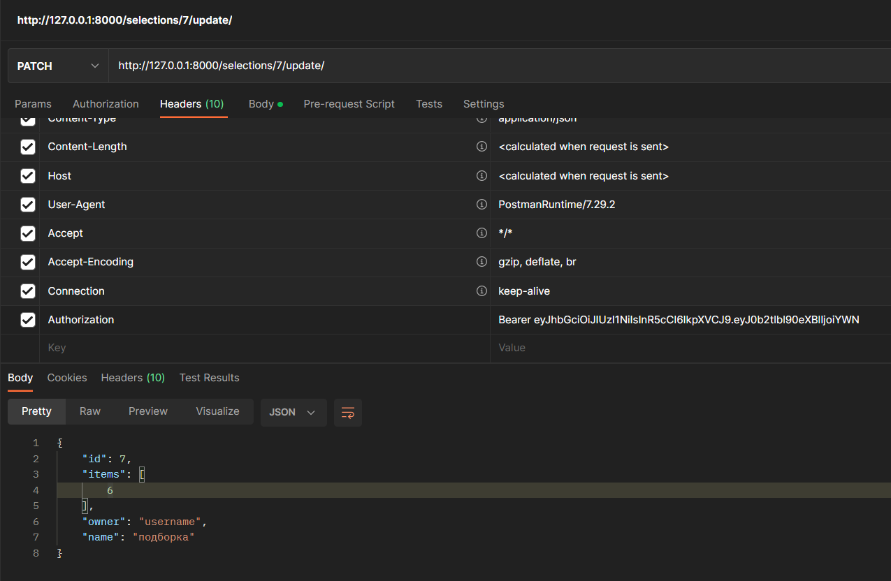
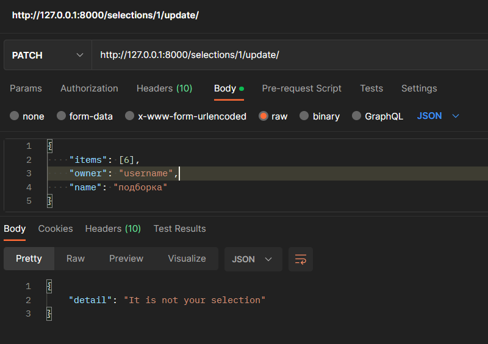

## Проект “Django-приложение для публикации объявлений (типа Авито)”

#### Проект сделан на языке Python с использованием фреймворка API Django REST framework и БД PostgreSQL

### Функционал приложения:

- CRUD для пользователей, категорий, объявлений и локаций. Вьюшки реализованы с помощью GenericAPIView и ModelViewSet
- Создана возможность делать авторские подборки объявлений для пользователей Selections (GenericAPIView)   

**примеры запросов*

http://127.0.0.1:8000/selections/  
http://127.0.0.1:8000/selections/7/  
http://127.0.0.1:8000/selections/create/  
тело запроса: {
    "items": [1],
    "owner": "username1",
    "name": "подборка1"
}  
http://127.0.0.1:8000/selections/7/update/  
тело запроса: {
    "items": [6],
    "owner": "username",
    "name": "подборка"
}  
http://127.0.0.1:8000/selections/7/delete/  

- Подключена админка (user: admin, пароль: 1234) для работы со всеми моделями

- Создана кастомная модель пользователя User, унаследованная от AbstractUser

- Авторизация пользователя по JWT  

**пример запроса*

http://127.0.0.1:8000/user/token/

тело запроса: {
    "password": "123as",
    "username": "username"
}

- Оформлены различные доступы для пользователей: 

  1. Просмотр объявлений только для зарегистрированных пользователей, а редактирование и удаление только для автора объявления или пользователя с ролью модератор/админ
  2. Просмотр подборок объявлений для всех пользователей, а редактирование и удаление только для автора подборки  
  

  **редактирование своей подборки*
  
  **редактирование чужой подборки*
  

- Покрыты тестами: 
  1. создание объявления — POST /ads (create_ads_test); 
  2. создание подборки — POST /selection (create_ selection _test); 
  3. выдача списка объявлений (без фильтров) — GET /ads (ad_list_test); 
  4. выдача одного объявления — GET /ads/<ad_id> (ad_detail_test).

